# RSSFeeder - Developer Guide

A lightweight, web-based RSS/Atom aggregation tool that centralizes content consumption by collecting feed entries, managing read/unread states, supporting tagging, and providing a polished SPA interface for organizing information.

## 🎯 Project Goals

RSSFeeder solves the problem of fragmented content consumption by providing:

- **Centralized Subscriptions**: Store feed URLs, titles, and metadata with user subscription tracking
- **Content Management**: Periodically fetch and cache feed entries with persistent read/unread states
- **Organization**: Tag items with labels and browse by feed, date, tag, or unread status
- **Unified Interface**: Single "inbox" view of latest entries across all subscriptions with filtering

## 🚀 Quick Start

**Get your development environment running in minutes:**

```bash
# Clone the repository
git clone https://github.com/your-org/rssfeeder.git
cd rssfeeder

# Run automated setup (cross-platform)
npm run setup
```

**That's it!** The setup script will:
- ✅ Install all dependencies
- ✅ Set up the database with migrations
- ✅ Configure environment variables
- ✅ Run tests to verify everything works
- ✅ Optionally start the development server

### Alternative Setup Methods

```bash
# Platform-specific setup
npm run setup:unix     # macOS/Linux
npm run setup:windows  # Windows

# Manual validation
npm run validate       # Check setup without starting server
```

### Quick Access

Once running:
- **Backend API**: http://localhost:3000/api/v1
- **Health Check**: http://localhost:3000/health
- **Frontend**: http://localhost:5173 (when implemented)

For detailed setup instructions, troubleshooting, and manual installation, see **[QUICKSTART.md](QUICKSTART.md)**.

## 🏗️ MVP Architecture

The MVP follows a clean separation between frontend SPA and backend API, with SQLite for local persistence.

```mermaid
flowchart TD
    rss["📁 rssfeeder"]
    back["📁 backend"]
    bd["📁 db"]
    mig["📁 migrations"]
    ctrl["📁 controllers"]
    mdl["📁 models"]
    route["📁 routes"]
    mid["📁 middlewares"]
    testsBE["📁 tests"]
    app["📄 app.js"]
    config["📄 config.js"]
    scripts["📄 script.js"]

    front["📁 frontend"]
    src["📁 src"]
    comp["📁 components"]
    views["📁 views"]
    store["📁 store"]
    router["📁 router"]
    plugins["📁 plugins"]
    assets["📁 assets"]
    main["📄 main.js"]
    AppVue["📄 App.vue"]

    rootFiles["📄 .env.development"]
    rootFiles2["📄 .env.production"]
    pkg["📄 package.json"]
    readme["📄 README.md"]
    gitignore["📄 .gitignore"]

    rss --> back
    back --> bd
    back --> mig
    back --> ctrl
    back --> mdl
    back --> route
    back --> mid
    back --> testsBE
    back --> app
    back --> config

    bd --> DataModel
    mig --> 001
    mig --> 002
    mig --> 003
    mig --> 004
    mig --> 005
    mig --> 006
    mig --> 007
    mig --> 008

    rss --> front
    front --> src
    src --> comp
    src --> views
    src --> store
    src --> router
    src --> plugins
    src --> assets
    src --> main
    src --> AppVue

    rss --> rootFiles
    rss --> rootFiles2
    rss --> pkg
    rss --> readme
    rss --> gitignore

    classDef folder fill:#e1f5fe,stroke:#0277bd,stroke-width:2px
    classDef file fill:#fff3e0,stroke:#f57c00,stroke-width:1px
``` 



## 🗄️ Database Schema

The application uses a relational SQLite database with 10 core tables:

### Core Entities
- **User**: Profile, preferences, and settings
- **Feed**: RSS/Atom feed sources with polling configuration
- **FeedItem**: Individual articles/entries from feeds
- **Category**: Tags/labels for content organization

### Relationship Tables
- **UserFeedSubscription**: User subscriptions to feeds
- **ReadState**: Per-user read/unread tracking
- **Bookmark**: User bookmarking system
- **ItemCategory**: Many-to-many feed item categorization
- **Nugget**: User actions and AI integration hooks
- **PollLog**: Audit trail for feed polling operations

See `backend/db/DataModel.md` for complete schema documentation and ERD.

## 🛠️ Tech Stack

### Frontend
- **Vue 3** with Composition API for reactive UI
- **Pinia** for centralized state management
- **Vue Router** for SPA navigation
- **Element Plus** or **Vuetify** for UI component library
- **Axios** for API communication

### Backend
- **Node.js + Express** following MVC architecture
- **SQLite** for embedded database (no setup required)
- **Knex.js** for query building and migrations
- **node-cron** for scheduled feed polling
- **RSS parser** for feed processing

### Development Tools
- **dotenv** for environment configuration
- **ESLint + Prettier** for code quality
- **Jest + Supertest** for testing
- **Nodemon** for development auto-restart
- **GitHub Actions** for CI/CD

## 🚀 Getting Started

### Prerequisites
- Node.js 18+ and npm
- Git

### Setup

```bash
# Clone the repository
git clone https://github.com/your-org/rssfeeder.git
cd rssfeeder

# Install dependencies
npm install

# Configure environment
cp .env.example .env.development
# Edit .env.development with your settings

# Initialize database
npm run migrate

# Seed with sample data (optional)
npm run seed

# Start development servers
npm run dev
```

### Development Commands

```bash
# Quick setup and validation
npm run setup           # Complete automated setup
npm run validate        # Verify setup without starting server

# Server management
npm run dev:backend     # Start backend only
npm run dev:frontend    # Start frontend only (when implemented)
npm run dev            # Start both backend and frontend

# Database management
npm run migrate:dev     # Run database migrations
npm run db:reset       # Reset database (rollback all + migrate)
npm run clean:db       # Delete database files

# Testing & quality
npm test               # Run test suite with enhanced logging
npm run test:coverage  # Run tests with coverage and logging
npm run test:log:full  # Full test analysis (coverage + performance + CI/CD)
npm run test:demo      # Interactive test logging demo
npm run check          # Run linting and tests
npm run stage:check    # Verify Stage B1 completion

# Code quality
npm run lint           # Lint code
npm run format         # Format code
npm run lint:fix       # Fix linting issues

# Maintenance
npm run clean          # Clean install (remove node_modules)
npm run reset          # Reset database and migrate
npm run health         # Check server health
```

## 📁 Key Directories

### Backend Structure
- `backend/controllers/` - Route handlers and business logic
- `backend/models/` - Data models and database interactions
- `backend/routes/` - API endpoint definitions
- `backend/middlewares/` - Authentication, validation, error handling
- `backend/db/migrations/` - Database schema versioning
- `backend/tests/` - API and integration tests

### Frontend Structure
- `frontend/src/components/` - Reusable Vue components
- `frontend/src/views/` - Page-level components
- `frontend/src/store/` - Pinia stores for state management
- `frontend/src/router/` - Vue Router configuration
- `frontend/src/assets/` - Static assets (images, styles)

## 🔄 Core Workflows

### Feed Management
1. **Add Feed**: Validate URL → Parse metadata → Store in database
2. **Poll Feeds**: Scheduled job → Fetch new items → Update database
3. **Process Items**: Parse content → Extract metadata → Apply categories

### User Experience
1. **Authentication**: Login/register → JWT tokens → Session management
2. **Feed Reading**: Fetch items → Mark as read → Update UI state
3. **Organization**: Create categories → Tag items → Filter views

### Data Flow
```
RSS Feed → Parser → Database → API → Frontend → User Interface
```

## 📋 MVP Feature Checklist

### Core Features
- [ ] User registration and authentication
- [ ] Feed subscription management
- [ ] Automatic feed polling and item fetching
- [ ] Read/unread state tracking
- [ ] Basic categorization/tagging
- [ ] Responsive web interface

### Nice-to-Have
- [ ] Bookmarking system
- [ ] Search functionality
- [ ] Import/export OPML
- [ ] Dark mode toggle
- [ ] Mobile app (PWA)

## 🧪 Testing Strategy

- **Unit Tests**: Models, utilities, and pure functions
- **Integration Tests**: API endpoints and database interactions
- **E2E Tests**: Critical user flows (login, subscribe, read)
- **Test Data**: Fixtures and factories for consistent testing

## 🚢 Deployment

The MVP is designed for simple deployment:

```bash
# Build frontend
npm run build

# Start production server
npm start

# Run with PM2 for production
pm2 start ecosystem.config.js
```

## 📚 Additional Resources

- [Database Schema Documentation](backend/db/DataModel.md)
- [API Documentation](docs/API.md)
- [Test Logging System](docs/TEST_LOGGING.md)
- [Component Library](docs/COMPONENTS.md)
- [Deployment Guide](docs/DEPLOYMENT.md)

## 🤝 Contributing

1. Fork the repository
2. Create a feature branch (`git checkout -b feature/amazing-feature`)
3. Commit changes (`git commit -m 'Add amazing feature'`)
4. Push to branch (`git push origin feature/amazing-feature`)
5. Open a Pull Request

## 📄 License

This project is licensed under the MIT License - see the [LICENSE](LICENSE) file for details.
