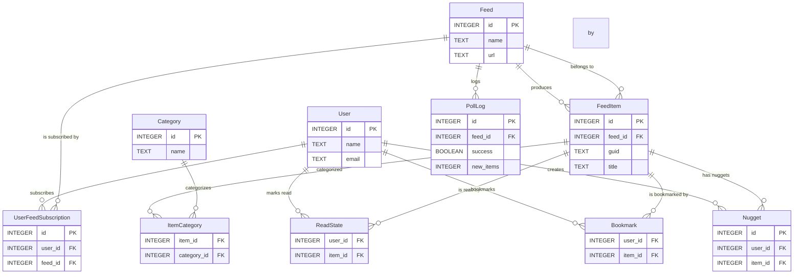

# Data Model

This document describes the entities, relationships, and cardinalities for the Feed Monitor App data model. It also includes a Mermaid ER diagram illustrating the schema visually.

## Entities

- **User**  
  Stores user profile and settings.
- **Feed**  
  Represents an RSS feed source (URL, name, status, schedule).
- **FeedItem**  
  Individual article/item fetched from a feed.
- **Category**  
  Tags or classifications for feed items.
- **ItemCategory**  
  Join table linking FeedItems to Categories (many-to-many).
- **UserFeedSubscription**  
  Join table representing which Users subscribe to which Feeds, with per-subscription preferences.
- **ReadState**  
  Tracks when a User marks a FeedItem as read.
- **Bookmark**  
  Tracks when a User bookmarks a FeedItem.
- **Nugget**  
  User-created actions on FeedItems (reply, reshare, comment, bookmark, etc.).
- **PollLog**  
  Audit logs for each feed polling operation (timestamp, success, new item count).

## Relationships & Cardinalities

- A **User** can subscribe to **many Feeds** (via **UserFeedSubscription**), and a **Feed** can have **many subscribing Users** (many-to-many).
- A **Feed** can produce **many FeedItems**; each **FeedItem** belongs to exactly one **Feed** (one-to-many).
- A **FeedItem** can have **zero or more Categories**; a **Category** can apply to **many FeedItems** (many-to-many via **ItemCategory**).
- A **User** can mark **many FeedItems** as read (via **ReadState**); each **ReadState** record links one **User** and one **FeedItem**.
- A **User** can bookmark **many FeedItems** (via **Bookmark**); each **Bookmark** record links one **User** and one **FeedItem**.
- A **User** can create **many Nuggets**; each **Nugget** belongs to one **User** and one **FeedItem** (one-to-many).
- A **Feed** can have **many PollLogs**; each **PollLog** belongs to one **Feed** (one-to-many).

## ER Diagram

