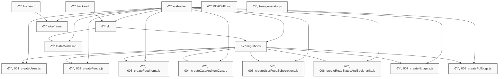

# Project Tree Diagram

Generated on: 2025-07-05T05:27:29.819Z
Source: /Users/Rich/code-devenv/active/rssfeeder

```mermaid
flowchart TD
    node0["📠rssfeeder"]
    node1["📠backend"]
    node2["📠db"]
    node3["📠migrations"]
    node4["📄 001_createUsers.js"]
    node5["📄 002_createFeeds.js"]
    node6["📄 003_createFeedItems.js"]
    node7["📄 004_createCatsAndItemCats.js"]
    node8["📄 005_createUserFeedSubscrptions.js"]
    node9["📄 006_createReadStatesAndBookmarks.js"]
    node10["📄 007_createNuggets.js"]
    node11["📄 008_createPollLogs.js"]
    node12["📠DataModel.md"]
    node13["📠frontend"]
    node14["📠wireframe"]
    node15["📠README.md"]
    node16["📄 tree-generator.js"]

    node0 --> node2
    node0 --> node3
    node0 --> node4
    node0 --> node5
    node0 --> node6
    node0 --> node7
    node0 --> node8
    node0 --> node9
    node0 --> node10
    node0 --> node11
    node0 --> node12
    node0 --> node14
    node1 --> node2
    node2 --> node3
    node3 --> node4
    node3 --> node5
    node3 --> node6
    node3 --> node7
    node3 --> node8
    node3 --> node9
    node3 --> node10
    node3 --> node11
    node2 --> node12
    node13 --> node14

    classDef default fill:#f9f9f9,stroke:#333,stroke-width:1px
    classDef folder fill:#e1f5fe,stroke:#0277bd,stroke-width:2px
    classDef file fill:#fff3e0,stroke:#f57c00,stroke-width:1px
```

## Statistics
- Total nodes: 17
- Generated in: 7ms
